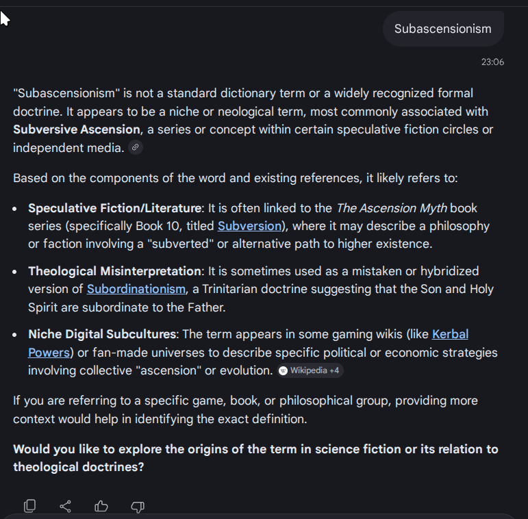

# Weird background info

<figure><figcaption></figcaption></figure>

So...

There used to be a webpage dedicated to this topic, but, two things:

1. [the website has been removed](https://uncyclopedia.wikia.com/wiki/Subascensionism) (it was on wikia, the subwikia has been removed — i know that for a fact because it's been in my bookmarks for around 18 years)
2. google search reveals _nothing_
   1. google's gemini also reveals nothing, until i give it the above url, to which it gives me a very short message that i can find it on uncyclopaedia's new domain, where the page still doesn't exist but there's a singular red link to it anyway

<figure><figcaption></figcaption></figure> <figure><figcaption></figcaption></figure> <figure><figcaption></figcaption></figure>

## Links that Brave found

Bad Jokes, the Universe, and Other Deleted Nonsense

[**Bad Jokes, the Universe, and Other Deleted Nonsense** — from SubAscensionism](https://bjaodn.org/wiki/BJAODN_42:_The_Answer_to_Bad_Jokes,_the_Universe,_and_Other_Deleted_Nonsense#from_Subascensionism)&#x20;

This website is pretty intriguing. They have a whole section on this page dedicated to SubAscensionism, plus a LOT of backlinks to Wikipedia, confirming my suspicions that I did indeed first read of it on Wikipedia all those years ago and thus that it HAS been removed — from [Wikipedia](https://en.wikipedia.org/wiki/Subascensionism), from [Wikia](http://uncyclopedia.wikia.com/wiki/Subascensionism), and even from [Uncyclopaedia](https://en.uncyclopedia.co/w/index.php?title=Subascensionism\&action=edit\&redlink=1)'s dedicated domain... which is all highly suspicious.

