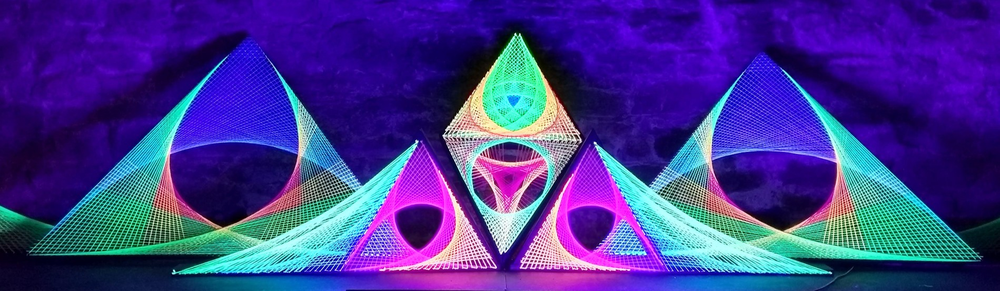

# 🎉 Event décor

<figure><figcaption>
<em>My first-ever string art project, designed for the pre-party for the first Anthropos Festival, hosted by us, Psychedelic Jelly</em>
</figcaption></figure>

## String art

I first saw string art at psychedelic festivals.

I guess it was 2015 or so.

I was first _introduced_ to string art by my friend Gombi, at Psy-Fi festival in the Netherlands. He showed me photos of what he had made in his bedroom in Hungary. It blew my mind.

What also blew my mind was the realisation that I could create this kind of stuff if I wanted.

I wanted.

One day I woke up and felt inspired to do it.

I looked out of my window and saw, on the other side of the road, a giant pile of waste wood.

I wandered over, loitered for a bit, trying to see if I was allowed to be there. Actually it was raining a lot, and there was nobody around. The wood was clearly discarded. I took some back to my house, then my housemate Steven came out with me to help me carry more back home.

After digging through a bunch of second hand shops and coming up empty, I found a bunch of UV-reactive wool online from someone who didn't need it any more. I went to the local hardware store and bought black wood paint, paintbrushes, nails, screws, a hammer, and a saw.

***

#### To do&#x20;

string art

* [x] string art header photo
* [ ] string art story
* [ ] srting art creation photos
* [ ] string art photos

fire space

* [ ] fire space header photos
* [ ] fire space story
* [ ] fire space creation photos
* [ ] fire space photos

string jellyfish

* [ ] jelly photo
* [ ] jelly story
* [ ] jelly creation photos
* [ ] jelly video

