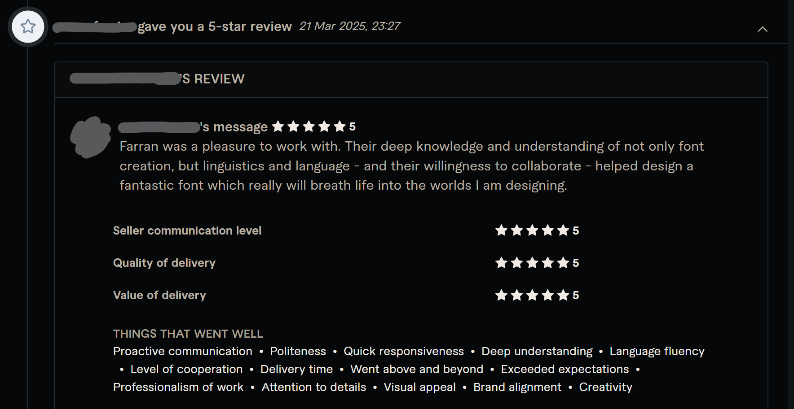

# Graphic Design

bobo&#x20;

psyjelly&#x20;

la llamada&#x20;

## Fiverr commissions

BlockTrain typeface designs for a client creating a 3D computer game. I designed a formal, block-based typeface, and derived a naturalised handwritten style, and I digitized both into two separate fonts with full feature parity, floating diacritics, and common symbols & punctuation.

Here is the review from my happy client:

<figure><figcaption></figcaption></figure>

Here is a screenshot of the two font files overlaid:

<figure><picture><source srcset="../.gitbook/assets/image_2025-03-24_163400486.png" media="(prefers-color-scheme: dark)"></picture><figcaption></figcaption></figure>
